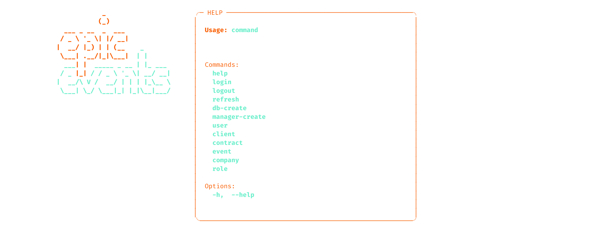
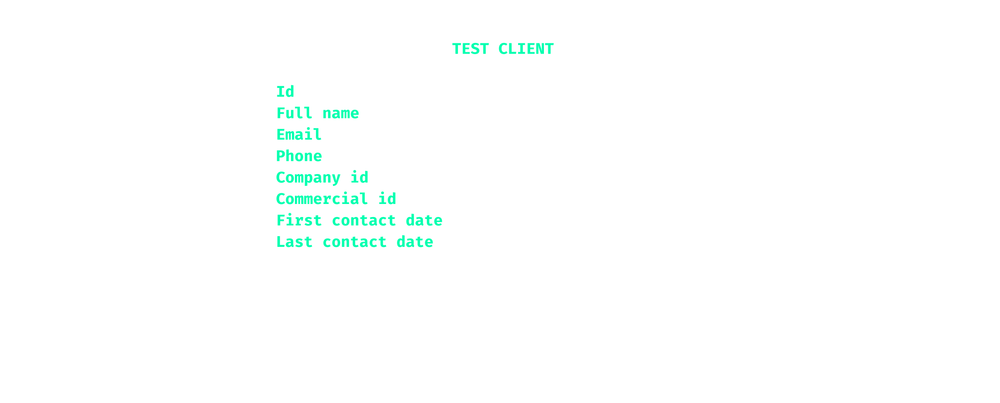

[](https://github.com/astral-sh/uv)
[](https://www.python.org/)
[](https://www.sqlalchemy.org/)


<div align="center">

# [🇫🇷 Français](#epic-events-crm-fr) • [🇬🇧 English](#--1)

</div>  

&nbsp;  
&nbsp;  
&nbsp;  
&nbsp;  

<p align="center">
  
</p>
  
&nbsp;
&nbsp;  
&nbsp;  
&nbsp;&nbsp;  
&nbsp;
# <div align="center"> 🇫🇷

Un CRM en ligne de commande, moderne et robuste: authentification JWT, permissions par rôles (any/own/assigned/own_client), rotation et rafraîchissement des jetons, schéma PostgreSQL propre, interface console soignée et testée end‑to‑end.

---

## <div align="center">SOMMAIRE

- [Démarrage rapide](#demarrage-rapide)
- [Utilisation](#utilisation)
- [Rôles et permissions](#roles-et-permissions)
- [Base de données](#base-de-donnees)
- [Sécurité](#securite)
- [Tests et qualité](#tests-et-qualite)
- [Dépannage](#depannage)
- [Structure du projet](#structure-du-projet)

<a id="epic-events-crm-fr"></a>

## <div align="center"> DÉMARRAGE RAPIDE

1) Prérequis: PostgreSQL opérationnel + fichier `.env`. Voir l’exemple `.env.example` et la page **[INSTALLATION](./INSTALLATION.md)**.

Ici, nous considérerons que votre environnement virtuel python est prêt et activé. 

2) Initialisez la base (tables + seed des rôles/permissions):

```bash
python epic_events.py db-create
```

4) Créez un compte manager (droits admin ou root requis pour des raisons de sécurité):

```bash
sudo python epic_events.py manager-create -u admin -n "Admin User" -e admin@ex.com
```
`sudo` vous demandera d'entrer votre mot de passe admin, puis epic-events vous dermandera d'entrer le mot de passe de l'utilisateur manager en cours d'inscription (tous les autres paramètres ayant été passé en arguments en ligne de commande).``

5) Connectez-vous (le mot de passe est saisi en mode masqué, jamais en clair):

```bash
python epic_events.py login -u admin
```

Astuce: À ce stade, nous vous recommandons de définir un alias pratique:

```bash
alias epev="python epic_events.py"
```

## <div align="center"> UTILISATION

Affichez le menu d'aide:

```bash
epev help
# ou python epic_events.py help
```
Vous devriez voir la liste des principale commandes :



Commandes de niveau racine:

- `help` • `-h|--help`: aide stylisée (disponible partout)
- `login` / `logout` / `refresh`: gestion de session et rotation de jetons
- `db-create`: crée les tables et seed les rôles (idempotent)
- `manager-create`: crée un manager initial (root requis)
- Groupes: `user`, `client`, `contract`, `event`, `company`, `role`

Exemples rapides:

```bash
# Lister les clients (vue stylisée); ajouter
epev client list
```
Vous devriez voir quelque chose comme :


```bash
# Consulter un client
epev client view 8
```
Et maintenant l'écran affiche les détails d'un client de cette façon :

```bash
# Créer un contrat (les options manquantes sont demandées de manière interactive)
epev contract create --client-id 10 --commercial-id 5 \
  --total-amount 1200 --remaining-amount 200 --is-signed true

# Créer un événement (dates acceptent dd/mm/yyyy ou dd/mm/yyyy HH:MM)
epev event create --contract-id 1 --title "Salon B2B" \
  --full-address "42 Rue de Paris, 75000 Paris" \
  --start-date 01/11/2025 --end-date "02/11/2025 18:00" \
  --participant-count 200

# Affecter un support à un événement
epev event assign_support 7 23

# Administration des rôles
epev role list
epev role view 2
epev role grant 2 "client:update:own"
epev role revoke 2 "client:update:own"
epev role perms
```

Les champs non fournis en ligne de commande sont saisis en mode interactif avec validations (email, téléphone, mots de passe, rôles, montants, dates…). Aucun mot de passe n’est accepté en argument CLI.

Captures: `src/media/epic-ev-clients.svg`, `src/media/epic-ev-client.svg`.

## <div align="center"> RÔLES ET PERMISSIONS

Rôles par défaut (ID en base): `management` (1), `commercial` (2), `support` (3).

Codes de permissions (exemples):

- `client:list`, `client:view`, `client:create`, `client:update`, `client:delete`
- Suffixes portées: `:own`, `:assigned`, `:own_client` selon la ressource
- Exemples de politique:
  - Un commercial peut `client:view:own` et `client:update:own` (ses clients)
  - Un support peut `event:update:assigned` (ses événements)
  - La création d’événement autorise `event:create` ou `event:create:own_client` si le contrat appartient au commercial connecté

Administration des rôles via `role:*` (normalisé): les permissions sont stockées dans une table `permission` et une table d’association `role_permission`. Un miroir ARRAY (`role.permissions`) est conservé pour compatibilité. Le seeding synchronise les deux.

## <div align="center"> BASE DE DONNÉES

- Moteur: PostgreSQL, schéma dédié `epic_events`
- Modèles: `User`, `Role`, `PermissionModel`, `Company`, `Client`, `Contract`, `Event`
- Intégrité et contraintes:
  - `Event`: `end_date > start_date`, `participant_count >= 0`
  - `Contract`: `remaining_amount >= 0`
  - FK explicites avec `ondelete` cohérents (RESTRICT/SET NULL/CASCADE) et index de filtrage
- Initialisation: `db-create` crée les tables; le seed rôles/permissions s’exécute uniquement si la base ne contient aucune donnée (sinon, pas de modification des droits existants)

## <div align="center"> SÉCURITÉ

- Authentification JWT HS256
  - Access token: 30 min; Refresh token: 1 jour (rotation et stockage hashé côté base)
  - En‑tête `kid` géré: clés actuelles et de repli acceptées pour un rollover sans coupure
  - Variables d’environnement: `SECRET_KEY` (**obligatoire**), `JWT_KID` (ex. `v1`), `SECRET_KEY_PREV`, `JWT_KID_PREV` (*facultatives*)
- Stockage local des jetons: fichier temporaire protégé (0600) dans le dossier système, jamais affiché à l’écran
- Mots de passe: saisis via prompt masqué; hash `bcrypt` stocké en base
- SQL: usage exclusif des paramètres via SQLAlchemy; test de garde interdisant tout f‑string SQL
- Observabilité: intégration Sentry activable (`SENTRY_DSN`, `SENTRY_ENVIRONMENT`, etc.)

## <div align="center"> TESTS ET QUALITÉ

- Lancer la suite:

```bash
pytest -q
```

- Portée des tests: auth/JWT (dont rollover), permissions/policy, business logic, CLI (smoke tests), sécurité SQL
- Lint: Ruff (`pyproject.toml`) — `ruff check .` puis `ruff check . --fix`

## <div align="center"> DÉPANNAGE

- “Please login first”: aucun access token actif → `epic-events login`
- “Session missing or expired”: refresh expiré/absent → `epic-events login` ou `epic-events refresh`
- “You don’t have permission …”: vérifiez votre rôle/permissions → `epic-events role view <id>` puis `role grant`
- “SECRET_KEY is not set”: définissez la variable `SECRET_KEY` (et éventuellement `JWT_KID`, `SECRET_KEY_PREV`, `JWT_KID_PREV`)
- Problèmes DB: vérifier `.env`, le service PostgreSQL puis `epic-events db-create`

## <div align="center"> STRUCTURE DU PROJET

```
src/
  cli/                 # CLI Click + rendu Rich (aide stylisée)
  controllers/         # Orchestration I/O + validations interactives
  business_logic/      # Règles métier (users/clients/contracts/events/roles)
  data_access/         # Config SQLAlchemy, création tables/seed
  crm/models.py        # Modèles ORM + contraintes/index
  auth/                # Login/Logout, JWT, policy/permissions, validators
  views/               # Composants Rich (bannières, tables, prompts)
  sentry/              # Initialisation observabilité
```

---  
&nbsp;  
&nbsp;  
&nbsp;  
&nbsp;  

<p align="center">
  
</p>
  
&nbsp;
&nbsp;  
&nbsp;  
&nbsp;&nbsp;  
&nbsp;
# <div align="center"> 🇬🇧 

## <div align="center">QUICK START

1. Prerequisites: a running PostgreSQL instance and a `.env` file. See the sample `.env.example` and the **[INSTALLATION](./INSTALLATION.md)** page.

2. Create and activate a Python environment, then install the project and its dependencies:

```bash
uv venv && source .venv/bin/activate                     # or python -m venv .venv
uv pip install -e .                                      # or python -m pip install -e .
```

3. Initialize the database (tables + seed roles/permissions if the database is empty):

```bash
python epic_events.py db-create
```

4. Create a manager account (root privileges required for security reasons):

```bash
sudo python epic_events.py manager-create -u admin -n "Admin User" -e admin@ex.com
```

5. Log in (the password is entered in masked mode, never in clear text):

```bash
python epic_events.py login -u admin
```

Tip: set a convenient alias:

```bash
alias epev="python epic_events.py"
```

## <div align="center"> USAGE

Display the styled help with logo:

```bash
epev help
```


Root-level commands:

* `help` • `-h|--help`: styled help (available everywhere)
* `login` / `logout` / `refresh`: session management and token rotation
* `db-create`: create tables and seed roles (idempotent)
* `manager-create`: create an initial manager (root required)
* Groups: `user`, `client`, `contract`, `event`, `company`, `role`

Quick examples:

```bash
# List clients (styled view)
epev client list
```

You should see something like:


```bash
# View a client
epev client view 8
```

Now the screen shows the client details like this:


```bash
# Create a contract (missing options are prompted interactively)
epev contract create --client-id 10 --commercial-id 5 \
  --total-amount 1200 --remaining-amount 200 --is-signed true

# Create an event (dates accept dd/mm/yyyy or dd/mm/yyyy HH:MM)
epev event create --contract-id 1 --title "B2B Fair" \
  --full-address "42 Rue de Paris, 75000 Paris" \
  --start-date 01/11/2025 --end-date "02/11/2025 18:00" \
  --participant-count 200

# Assign a support user to an event
epev event assign_support 7 23

# Role administration
epev role list
epev role view 2
epev role grant 2 "client:update:own"
epev role revoke 2 "client:update:own"
epev role perms
```

Fields not provided on the command line are entered interactively with validation (email, phone, passwords, roles, amounts, dates…). No password is ever accepted as a CLI argument.

Screenshots: `src/media/epic-ev-clients.svg`, `src/media/epic-ev-client.svg`.

## <div align="center"> ROLES AND PERMISSIONS

Default roles (DB ID): `management` (1), `commercial` (2), `support` (3).

Permission codes (examples):

* `client:list`, `client:view`, `client:create`, `client:update`, `client:delete`
* Scope suffixes: `:own`, `:assigned`, `:own_client` depending on the resource
* Policy examples:

  * A commercial can `client:view:own` and `client:update:own` (their own clients)
  * A support user can `event:update:assigned` (their assigned events)
  * Event creation allows `event:create` or `event:create:own_client` if the contract belongs to the logged-in commercial

Role administration via `role:*` (normalized): permissions are stored in a `permission` table and an association table `role_permission`. An ARRAY mirror (`role.permissions`) is kept for compatibility. Seeding synchronizes both.

## <div align="center"> DATABASE

* Engine: PostgreSQL, dedicated schema `epic_events`
* Models: `User`, `Role`, `PermissionModel`, `Company`, `Client`, `Contract`, `Event`
* Integrity and constraints:

  * `Event`: `end_date > start_date`, `participant_count >= 0`
  * `Contract`: `remaining_amount >= 0`
  * Explicit FKs with consistent `ondelete` (RESTRICT/SET NULL/CASCADE) and filter indexes
* Initialization: `db-create` creates tables; role/permission seeding runs only if the database contains no data (otherwise, existing rights are left untouched)

## <div align="center"> SECURITY

* JWT HS256 authentication

  * Access token: 30 min; Refresh token: 1 day (rotation and hashed storage in DB)
  * `kid` header managed: current and fallback keys accepted for seamless rollover
  * Environment variables: `SECRET_KEY` (required), `JWT_KID` (e.g. `v1`), `SECRET_KEY_PREV`, `JWT_KID_PREV` (optional)
* Local token storage: protected temporary file (0600) in the system folder, never displayed on screen
* Passwords: entered via masked prompt; `bcrypt` hash stored in DB
* SQL: exclusively parameterized queries via SQLAlchemy; guard test prevents any SQL f-string
* Observability: Sentry integration enabled via `SENTRY_DSN`, `SENTRY_ENVIRONMENT`, etc.

## <div align="center"> TESTS AND QUALITY

* Run the test suite:

```bash
pytest -q
```

* Test coverage: auth/JWT (including rollover), permissions/policy, business logic, CLI (smoke tests), SQL security
* Linting: Ruff (`pyproject.toml`) — `ruff check .` then `ruff check . --fix`

## <div align="center"> TROUBLESHOOTING

* “Please login first”: no active access token → `epev login`
* “Session missing or expired”: refresh expired/missing → `epev login` or `epev refresh`
* “You don’t have permission …”: check your role/permissions → `epev role view <id>` then `role grant`
* “SECRET\_KEY is not set”: set the `SECRET_KEY` variable (and optionally `JWT_KID`, `SECRET_KEY_PREV`, `JWT_KID_PREV`)
* DB issues: check `.env`, the PostgreSQL service, then run `epev db-create`

## <div align="center"> PROJECT STRUCTURE

```
src/
  cli/                 # Click CLI + Rich rendering (styled help)
  controllers/         # I/O orchestration + interactive validation
  business_logic/      # Business rules (users/clients/contracts/events/roles)
  data_access/         # SQLAlchemy config, table creation/seed
  crm/models.py        # ORM models + constraints/indexes
  auth/                # Login/Logout, JWT, policy/permissions, validators
  views/               # Rich components (banners, tables, prompts)
  sentry/              # Observability initialization
```

