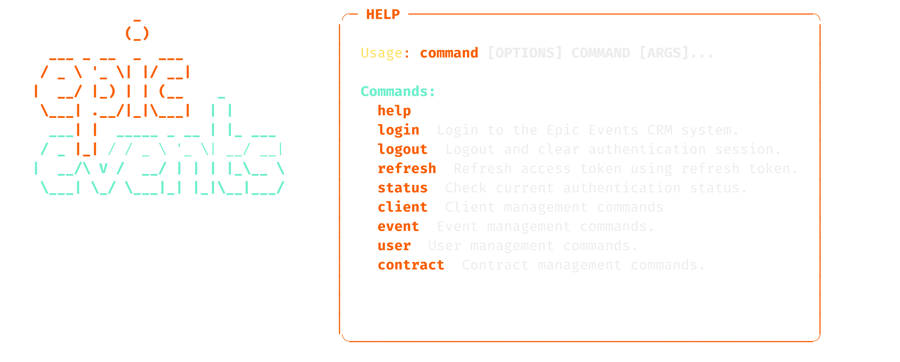

[](https://github.com/astral-sh/uv) [](https://www.python.org/) [](https://www.sqlalchemy.org/)    


# Epic Events CRM

A cool Customer Relationship Management (CRM) system using Python. It’s got all the bells and whistles, like user authentication, role-based permissions, and a really smooth command-line interface.


## Quick Start

To learn more about the installation, it's recommended to read the **[INSTALLATION](./INSTALLATION.md)** page. Here we consider you've already cloned the repository, got Postgresql services running, a database ready to go and a virtual environment activated.

## Usage  

If you try this:
```bash
python epic_events.py --help
```
This is what you should see:


At this point, for more convenience, it is recommended to:

```bash
alias epic-events="python epic_events.py"
```

This way, it is possible to 

```bash
epic-events help
```

## Commands

#### `init-db`

This is the first command that should be launched after installation. It initializes the database and sets up the necessary data required by the app to start running (it initializes the role IDs, allowing you to create users and start providing them with roles).

#### `init-manager`

This command can only be run with root privileges (`sudo` on Unix systems). It allows you to create a user with the management role, typically a user with the permission to create other user profiles.

**Usage:** 
```bash
# With sudo we have to use the original command
sudo python epic_events.py init-manager -u [USERNAME] -n [FULL_NAME] -e [EMAIL]
```
`sudo` will ask you for your root password, then epic-events will ask for the password of the manager user that is being created.

#### `create-user`

This command requires you to be connected to the CRM and to be a manager user. In order to make it work, it should receive as an argument an access token proving the role of the requesting user.

**Usage:** 
```bash
epic-events create-user -t [ACCESS_TOKEN] -u [USERNAME] -n [FULL_NAME] -e [EMAIL] -r [ROLE_ID]
```

#### `login`

Authenticate a user and obtain an access token.

**Usage:**
You can provide your username as an argument or be prompted for it.
```bash
epic-events login -u [USERNAME]
```

#### `create-client`

Create a new client. This command requires a commercial user token, otherwise it will display an error message.
The access token is mandatory.

The other arguments are optional. If they are not provided, the user will be prompted to enter them.

**Usage:**
```bash
epic-events create-client -t [ACCESS_TOKEN] -n [FULL_NAME] -e [EMAIL] -p [PHONE] -c [COMPANY_ID] -d [FIRST_CONTACT_DATE]
```

#### `list-clients`

List all clients or, optionally, only the clients assigned to the current commercial user. 
This command is available for all users in readonly, requiring at least to be logged in.
access token required but no role check is performed.
However, if the user is a commercial user, the command can be filtered to only list the clients assigned to the current commercial user. In this case, the access token must be a commercial user token, and the filtered must be set to true : `-f true`.

**Usage:**
```bash
epic-events list-clients -t [ACCESS_TOKEN] -f [FILTERED]
```