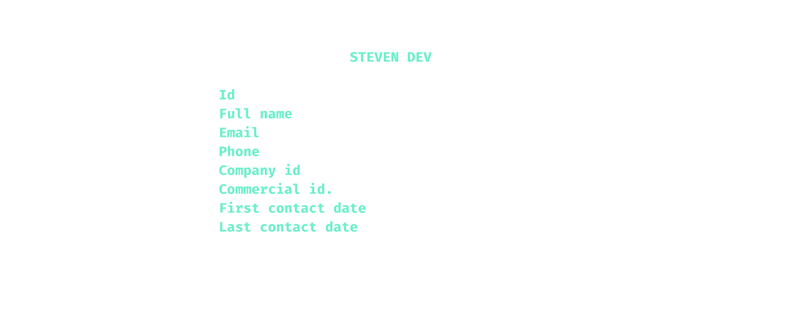

[](https://github.com/astral-sh/uv)
[](https://www.python.org/)
[](https://www.sqlalchemy.org/)
[](https://www.postgresql.org/docs/16/index.html)
[](https://pyjwt.readthedocs.io/en/stable/)
[](https://rich.readthedocs.io/en/latest/introduction.html)
[](https://docs.sentry.io/platforms/python/)


<div align="center">

# [🇫🇷 Français](#fr) • [🇬🇧 English](#en)

</div>  

&nbsp;  
&nbsp;  
&nbsp;  
&nbsp;  

<p align="center">
  
</p>
  
&nbsp;
&nbsp;  
&nbsp;  
&nbsp;&nbsp;  
&nbsp;
<a id="fr"></a>  

# <div align="center"> 🇫🇷

Epic Events est une application en ligne de commande (CLI) conçue pour gérer les processus internes d'une agence événementielle. Elle permet de gérer les clients, les contrats et les événements, avec un système d'authentification et de permissions basé sur les rôles.

---

```ruby
			▄▖▄▖▖  ▖▖  ▖▄▖▄▖▄▖▄▖
			▚ ▌▌▛▖▞▌▛▖▞▌▌▌▐ ▙▘▙▖
			▄▌▙▌▌▝ ▌▌▝ ▌▛▌▟▖▌▌▙▖
```

- [Stack technique](#stack)
- [Démarrage rapide](#demarrage-rapide)
- [Utilisation](#utilisation)
- [Rôles et permissions](#roles-et-permissions)
- [Base de données](#base-de-donnees)
- [Sécurité](#securite)
- [Dépannage](#depannage)
- [Structure du projet](#structure-du-projet)
---  

<a id="stack"></a>
```ruby
		▄▖▄▖▄▖▄▖▖▖  ▄ ▖▖  ▄▖▄▖▄▖ ▖▄▖▄▖
		▚ ▐ ▌▌▌ ▙▘  ▌▌▌▌  ▙▌▙▘▌▌ ▌▙▖▐ 
		▄▌▐ ▛▌▙▖▌▌  ▙▘▙▌  ▌ ▌▌▙▌▙▌▙▖▐                             
```

- **Langage**: `Python` 3.9+
- **Framework CLI**: `Click` & `Rich` pour une interface utilisateur riche en couleurs et bien formatée.
- **Base de données**: `PostgreSQL`.
- **ORM**: `SQLAlchemy` pour l'interaction avec la base de données.
- **Gestion des dépendances**: `uv` pour un environnement de développement rapide et reproductible.- **Authentification**: Jetons `JWT` (JSON Web Tokens) avec rafraîchissement automatique.
- **Monitoring**: Intégration avec `Sentry` pour le suivi des erreurs.

---  

<a id="demarrage-rapide"></a>  
  
```ruby
	▄ ▄▖▖  ▖▄▖▄▖▄▖▄▖▄▖  ▄▖▄▖▄▖▄▖▄ ▄▖
	▌▌▙▖▛▖▞▌▌▌▙▘▌▌▌ ▙▖  ▙▘▌▌▙▌▐ ▌▌▙▖
	▙▘▙▖▌▝ ▌▛▌▌▌▛▌▙▌▙▖  ▌▌▛▌▌ ▟▖▙▘▙▖
```

Pour des instructions complètes, veuillez consulter la section [INSTALLATION](INSTALLATION.md#installation).

1.  **Installez les prérequis** (Python, `uv`, PostgreSQL).
2.  **Clonez le dépôt** et naviguez dans le dossier.
3.  **Créez et activez un environnement virtuel** avec `uv`.
4.  **Installez les dépendances** : `uv pip install -e .`
5.  **Configurez votre base de données** en créant un fichier `.env`.
6.  **Initialisez la base de données** : `python epic_events.py db-create`
7.  **Créez l'utilisateur manager** : `sudo python epic_events.py manager-create -u admin -n "Admin User" -e admin@ex.com`
	> _`sudo` vous demandera d'entrer votre mot de passe admin, puis `epic-events` vous dermandera d'entrer le mot de passe de l'utilisateur manager en cours d'inscription (tous les autres paramètres ayant été passé en arguments en ligne de commande)._
8.  **Connectez-vous** : `python epic_events.py login -u admin`
  
  ---  

>**ASTUCE** :   
_À ce stade, nous vous recommandons de définir un alias pratique  
Exemple :_

```bash
alias epev="python epic_events.py"
# OU
# alias epev="uv run epic_events.py"
# Vous pouvez définir l'alias sur 'epic-events' pour plus de clarté. Par souci de concision, nous choisirons ici 'epev'
# alias epic-events="python epic_events.py"
# alias epic-events="uv run epic_events.py"
```
Décommentez l'alias qui vous convient le mieux et ajoutez-le au fichier de configuration de votre shell (pour `zsh`: `.zshrc` ou `.zprofile`, pour `bash`: `.bashrc` ou `.bash_profile`)

--- 

<a id="utilisation"></a>
```ruby
        ▖▖▄▖▄▖▖ ▄▖▄▖▄▖▄▖▄▖▄▖▖ ▖
        ▌▌▐ ▐ ▌ ▐ ▚ ▌▌▐ ▐ ▌▌▛▖▌
        ▙▌▐ ▟▖▙▖▟▖▄▌▛▌▐ ▟▖▙▌▌▝▌
```          

Affichez le menu d'aide:

```bash
epev help
# ou python epic_events.py help
```
Vous devriez voir la liste des principale commandes :


Commandes de niveau racine:

- `help` • `-h|--help`: aide stylisée (disponible partout)
- `login` / `logout` / `refresh`: gestion de session et rotation de jetons
- `db-create`: crée les tables et seed les rôles (idempotent)
- `manager-create`: crée un manager initial (root requis)
- Groupes: `user`, `client`, `contract`, `event`, `company`, `role`

Exemples rapides:

```bash
# Lister les clients (vue stylisée); ajouter
epev client list
```
Vous devriez voir quelque chose comme :


```bash
# Consulter un client
epev client view 8
```
  
Et maintenant l'écran affiche les détails d'un client de cette façon :


```bash
# Créer un contrat (les options manquantes sont demandées de manière interactive)
epev contract create --client-id 10 --commercial-id 5 \
  --total-amount 1200 --remaining-amount 200 --is-signed true
```

```bash
# Créer un événement (dates acceptent dd/mm/yyyy ou dd/mm/yyyy HH:MM)
epev event create --contract-id 1 --title "Salon B2B" \
  --full-address "42 Rue de Paris, 75000 Paris" \
  --start-date 01/11/2025 --end-date "02/11/2025 18:00" \
  --participant-count 200
```

```bash
# Affecter un support à un événement
epev event assign_support 7 23
```

Les champs non fournis en ligne de commande sont saisis en mode interactif avec validations (email, téléphone, mots de passe, rôles, montants, dates…). Aucun mot de passe n’est accepté en argument CLI.

Captures: `src/media/epic-ev-clients.svg`, `src/media/epic-ev-client.svg`.

---  
  
<a id="roles-et-permissions"></a>
```ruby
		▄▖▄▖▖ ▄▖▄▖  ▄▖▄▖  ▄▖▄▖▄▖▖  ▖▄▖▄▖▄▖▄▖▄▖▖ ▖▄▖
		▙▘▌▌▌ ▙▖▚   ▙▖▐   ▙▌▙▖▙▘▛▖▞▌▐ ▚ ▚ ▐ ▌▌▛▖▌▚ 
		▌▌▙▌▙▖▙▖▄▌  ▙▖▐   ▌ ▙▖▌▌▌▝ ▌▟▖▄▌▄▌▟▖▙▌▌▝▌▄▌
```                                           

rôles: `management`, `commercial`, `support`.

Codes de permissions (exemples):
- `client:list`, `client:view`, `client:create`, `client:update`, `client:delete`
- Suffixes portées: `:own`, `:assigned`, `:own_client` selon la ressource

Exemples de politique:
  - Un commercial peut `client:view:own` et `client:update:own` (ses clients)
  - Un support peut `event:update:assigned` (ses événements)
  - La création d’événement autorise `event:create` ou `event:create:own_client` si le contrat appartient au commercial connecté

Administration des rôles via `role:*` (normalisé): les permissions sont stockées dans une table `permission` et une table d’association `role_permission`. Un miroir ARRAY (`role.permissions`) est conservé pour compatibilité. Le seeding synchronise les deux.

---  
  
<a id="base-de-donnees"></a>
```ruby
			▄ ▄▖▄▖▄▖  ▄ ▄▖  ▄ ▄▖▖ ▖▖ ▖▄▖▄▖▄▖
			▙▘▌▌▚ ▙▖  ▌▌▙▖  ▌▌▌▌▛▖▌▛▖▌▙▖▙▖▚ 
			▙▘▛▌▄▌▙▖  ▙▘▙▖  ▙▘▙▌▌▝▌▌▝▌▙▖▙▖▄▌
```                                

- Moteur: PostgreSQL, schéma dédié `epic_events`
- Modèles: `User`, `Role`, `PermissionModel`, `Company`, `Client`, `Contract`, `Event`
- Intégrité et contraintes:
  - `Event`: `end_date > start_date`, `participant_count >= 0`
  - `Contract`: `remaining_amount >= 0`
  - FK explicites avec `ondelete` cohérents (RESTRICT/SET NULL/CASCADE) et index de filtrage
- Initialisation: `db-create` crée les tables; le seed rôles/permissions s’exécute uniquement si la base ne contient aucune donnée (sinon, pas de modification des droits existants)

---  

<a id="securite"></a>
```ruby
			▄▖▄▖▄▖▖▖▄▖▄▖▄▖▄▖
			▚ ▙▖▌ ▌▌▙▘▐ ▐ ▙▖
			▄▌▙▖▙▖▙▌▌▌▟▖▐ ▙▖
```                

- Authentification JWT HS256
  - Access token: 30 min; Refresh token: 1 jour (rotation et stockage hashé côté base)
  - En‑tête `kid` géré: clés actuelles et de repli acceptées pour un rollover sans coupure
  - Variables d’environnement: `SECRET_KEY` (**obligatoire**).
- Stockage local des jetons: fichier temporaire protégé (0600) dans le dossier système, jamais affiché à l’écran
- Mots de passe: saisis via prompt masqué; hash `bcrypt` stocké en base
- SQL: usage exclusif des paramètres via SQLAlchemy; test de garde interdisant tout f‑string SQL
- Observabilité: intégration Sentry activable (`SENTRY_DSN`, `SENTRY_ENVIRONMENT`, etc.)  

---  

<a id="depannage"></a>
```ruby
     ▄ ▄▖▄▖▄▖▖ ▖▖ ▖▄▖▄▖▄▖
     ▌▌▙▖▙▌▌▌▛▖▌▛▖▌▌▌▌ ▙▖
     ▙▘▙▖▌ ▛▌▌▝▌▌▝▌▛▌▙▌▙▖
```

- `Please login first`: aucun access token actif → `epic-events login`
- `Session missing or expired`: refresh expiré/absent → `epic-events login` ou `epic-events refresh`
- `You don’t have permission …`: vérifiez votre rôle/permissions.
- `SECRET_KEY is not set`: définissez la variable `SECRET_KEY`
- Problèmes DB: vérifier `.env`, le service PostgreSQL puis `epic-events db-create`

---  

<a id="structure-du-projet"></a>  

```ruby
		▄▖▄▖▄▖▖▖▄▖▄▖▖▖▄▖▄▖  ▄ ▖▖  ▄▖▄▖▄▖ ▖▄▖▄▖
		▚ ▐ ▙▘▌▌▌ ▐ ▌▌▙▘▙▖  ▌▌▌▌  ▙▌▙▘▌▌ ▌▙▖▐ 
		▄▌▐ ▌▌▙▌▙▖▐ ▙▌▌▌▙▖  ▙▘▙▌  ▌ ▌▌▙▌▙▌▙▖▐ 
```

```bash
src/
  cli/                 # CLI Click + rendu Rich (aide stylisée)
  controllers/         # Orchestration I/O + validations interactives
  business_logic/      # Règles métier (users/clients/contracts/events/roles)
  data_access/         # Config SQLAlchemy, création tables/seed
  crm/models.py        # Modèles ORM + contraintes/index
  auth/                # Login/Logout, JWT, policy/permissions, validators
  views/               # Composants Rich (bannières, tables, prompts)
  sentry/              # Initialisation observabilité
```

---  
  
<p align="center">
  
</p>
  
&nbsp;
&nbsp;  
&nbsp;  
&nbsp;
&nbsp;

---  
  
<a id="en"></a>  

# <div align="center"> 🇬🇧

Epic Events is a command-line interface (CLI) application designed to manage the internal processes of an event agency. It allows for the management of clients, contracts, and events, with a role-based authentication and permissions system.

---  

```ruby
		▄▖▖▖▖  ▖▖  ▖▄▖▄▖▖▖
		▚ ▌▌▛▖▞▌▛▖▞▌▌▌▙▘▌▌
		▄▌▙▌▌▝ ▌▌▝ ▌▛▌▌▌▐ 
```

- [Technical Stack](#stack-en)
- [Quick Start](#quick-start)
- [Usage](#usage)
- [Roles and Permissions](#roles-and-permissions)
- [Database](#database)
- [Security](#security)
- [Troubleshooting](#troubleshooting)
- [Project Structure](#project-structure)

---  
  
<a id="stack-en"></a>

```ruby
      ▄▖▄▖▄▖▖▖▖ ▖▄▖▄▖▄▖▖   ▄▖▄▖▄▖▄▖▖▖
      ▐ ▙▖▌ ▙▌▛▖▌▐ ▌ ▌▌▌   ▚ ▐ ▌▌▌ ▙▘
      ▐ ▙▖▙▖▌▌▌▝▌▟▖▙▖▛▌▙▖  ▄▌▐ ▛▌▙▖▌▌
                                 
```

- **Language**: `Python` 3.9+
- **CLI Framework**: `Click` & `Rich` for a colorful and well-formatted user interface.
- **Database**: `PostgreSQL`.
- **ORM**: `SQLAlchemy` for database interaction.
- **Migrations**: `Alembic` to manage database schema evolutions.
- **Dependency Management**: `uv` for a fast and reproducible development environment.
- **Authentication**: `JWT` (JSON Web Tokens) with automatic refresh.
- **Monitoring**: `Sentry` integration for error tracking.


<a id="quick-start"></a>  

```ruby
        ▄▖▖▖▄▖▄▖▖▖  ▄▖▄▖▄▖▄▖▄▖
        ▌▌▌▌▐ ▌ ▙▘  ▚ ▐ ▌▌▙▘▐ 
        █▌▙▌▟▖▙▖▌▌  ▄▌▐ ▛▌▌▌▐ 
         ▘                    
```

For complete instructions, please see the [INSTALLATION](./INSTALLATON.md#setup) section.
- Install prerequisites (`Python`, `uv`, `PostgreSQL`).
- Clone the repository and navigate into the folder.
- Create and activate a virtual environment with uv.
- Install dependencies: `uv pip install -e .`
- Configure your database by creating a .env file.
- Initialize the database: python epic_events.py db-create
- Create the manager user: sudo python epic_events.py manager-create -u admin -n "Admin User" -e admin@ex.com
	> `sudo` will ask for your admin password, then `epic-events` will ask you to enter the password for the manager user being created (all other parameters have been passed as command-line arguments).
- Log in: python epic_events.py login -u admin

Tip: At this point, we recommend setting up a convenient alias:  

```ruby
alias epev="python epic_events.py"
# OR
# alias epev="uv run epic_events.py"
# You can set the alias to epic-events for more clarity. For the sake of brevity, we'll choose epev here
# alias epic-events=`python epic_events.py`
# alias epic-events=`uv run epic_events.py`
``` 

Uncomment the alias that works best for you and add it to your shell's config file (for zsh: .zshrc or .zprofile)

<a id="usage"></a>

```ruby
      ▖▖▄▖▄▖▄▖▄▖
      ▌▌▚ ▌▌▌ ▙▖
      ▙▌▄▌▛▌▙▌▙▖
                
```

Display the help menu:

```bash
epev help
# python epic_events.py help`
```

You should see the list of main commands:

  

Root level commands:

- `help` • `-h|--help`: stylized help (available everywhere)
- `login` / `logout` / `refresh`: session management and token rotation
- `db-create`: creates tables and seeds roles (idempotent)
- `manager-create`: creates an initial manager (root required)
- Groups: `user`, `client`, `contract`, `event`, `company`, `role`

Quick examples:

```bash
# List clients (stylized view)
epev client list
```
You should see something like:  


```bash
# View a client's details
epev client view 8
```

And now the console displays a client's details like this:


```bash
# Create a contract (missing options are prompted interactively)
epev contract create --client-id 10 --commercial-id 5 \
  --total-amount 1200 --remaining-amount 200 --is-signed true
```

```bash
# Create an event (dates accept dd/mm/yyyy or dd/mm/yyyy HH:MM)
epev event create --contract-id 1 --title "B2B Trade Show" \
  --full-address "42 Rue de Paris, 75000 Paris" 
  --start-date 01/11/2025 --end-date "02/11/2025 18:00" \-
  --participant-count 200
```

```bash
# Assign support to an event
`epev event assign_support 7 23`
```

Fields not provided via command line are entered in interactive mode with validations (email, phone, passwords, roles, amounts, dates…). No password is accepted as a CLI argument.

Screenshots: `src/media/epic-ev-clients.svg`, `src/media/epic-ev-client.svg`.

---  
  
<a id="roles-and-permissions"></a>  

```ruby   
			  ▄▖▄▖▖ ▄▖▄▖         
			  ▙▘▌▌▌ ▙▖▚  
			  ▌▌▙▌▙▖▙▖▄▌                 
		▄▖▄▖▄▖▖  ▖▄▖▄▖▄▖▄▖▄▖▖ ▖▄▖
		▙▌▙▖▙▘▛▖▞▌▐ ▚ ▚ ▐ ▌▌▛▖▌▚ 
		▌ ▙▖▌▌▌▝ ▌▟▖▄▌▄▌▟▖▙▌▌▝▌▄▌                     
```

- **Default roles (DB IDs)**:
	- `management` (1), `commercial` (2), `support` (3)  

- **Permission codes (examples)**:  
	- `client:list`, `client:view`, `client:create`, `client:update`, `client:delete`

- **Scope suffixes**: 
	- `:own`, `:assigned`, `:own_client` depending on the resource  

**Policy examples**:
- A sales representative(`commercial`) can `client:view:own` and `client:update:own` (their own clients)
- A support staff(`support`) can `event:update:assigned` (their assigned events)
- Event creation allows `event:create` or `event:create:own_client` if the contract belongs to the logged-in sales representative(`commercial`)

**Role administration via role:* (normalized)**: 
- Permissions are stored in a permission table and a role_permission association table. 
- An ARRAY mirror (role.permissions) is kept for compatibility. 
- Seeding synchronizes both.

---  
   
<a id="database"></a>

```ruby
		▄ ▄▖▄▖▄▖▄ ▄▖▄▖▄▖
		▌▌▌▌▐ ▌▌▙▘▌▌▚ ▙▖
		▙▘▛▌▐ ▛▌▙▘▛▌▄▌▙▖

```

- **Engine**: PostgreSQL, dedicated schema `epic_events`
- **Models**: `User`, `Role`, `PermissionModel`, `Company`, `Client`, `Contract`, `Event`

**Integrity and constraints**:
- **Event**: `end_date > start_date`, `participant_count >= 0`
- **Contract**: `remaining_amount >= 0`
- **Explicit FKs with consistent ondelete (RESTRICT/SET NULL/CASCADE) and filter indexes**
- **Initialization**: `db-create` creates tables; the roles/permissions seed runs only if the database contains no data (otherwise, existing rights are not modified)

---  
  
<a id="security"></a>

```ruby
			▄▖▄▖▄▖▖▖▄▖▄▖▄▖▖▖
			▚ ▙▖▌ ▌▌▙▘▐ ▐ ▌▌
			▄▌▙▖▙▖▙▌▌▌▟▖▐ ▐ 
```

- **JWT HS256 Authentication**

- **Access token**: 30 min; Refresh token: 1 day (rotation and hashed storage in the database)
- **Managed kid header**: current and fallback keys are accepted for a seamless rollover
- **Environment variables**: `SECRET_KEY` (required), `JWT_KID` (e.g., v1), `SECRET_KEY_PREV`, `JWT_KID_PREV` (optional)
- **Local token storage**: protected temporary file (0600) in the system folder, never displayed on screen
- **Passwords**: entered via a hidden prompt; `bcrypt` hash stored in the database
- **SQL**: exclusive use of parameters via `SQLAlchemy`; guard test prohibiting any SQL f-string
- **Observability**: `Sentry` integration can be activated (`SENTRY_DSN`, `SENTRY_ENVIRONMENT`, etc.)

---  
  
<a id="troubleshooting"></a>

```ruby
  	▄▖▄▖▄▖▖▖▄ ▖ ▄▖▄▖▖▖▄▖▄▖▄▖▄▖▖ ▖▄▖
  	▐ ▙▘▌▌▌▌▙▘▌ ▙▖▚ ▙▌▌▌▌▌▐ ▐ ▛▖▌▌ 
  	▐ ▌▌▙▌▙▌▙▘▙▖▙▖▄▌▌▌▙▌▙▌▐ ▟▖▌▝▌▙▌                             
```

- **`Please login first”**: no active access token → `epic-events login`
- **`Session missing or expired”**: refresh token expired/missing → `epic-events login` or `epic-events refresh`
- **`SECRET_KEY is not set”**: define the `SECRET_KEY` variable (and optionally `JWT_KID`, `SECRET_KEY_PREV`, `JWT_KID_PREV`)
- **DB issues**: check `.env`, the PostgreSQL service, then `epic-events db-create`
  
---  

<a id="project-structure"></a>
  
```ruby
▄▖▄▖▄▖ ▖▄▖▄▖▄▖  ▄▖▄▖▄▖▖▖▄▖▄▖▖▖▄▖▄▖
▙▌▙▘▌▌ ▌▙▖▌ ▐   ▚ ▐ ▙▘▌▌▌ ▐ ▌▌▙▘▙▖
▌ ▌▌▙▌▙▌▙▖▙▖▐   ▄▌▐ ▌▌▙▌▙▖▐ ▙▌▌▌▙▖
```

```bash
src/
  cli/                 # Click CLI + Rich rendering (stylized help)
  controllers/         # I/O orchestration + interactive validations
  business_logic/      # Business rules (users/clients/contracts/events/roles)
  data_access/         # SQLAlchemy config, table creation/seed
  crm/models.py        # ORM models + constraints/indexes
  auth/                # Login/Logout, JWT, policy/permissions, validators
  views/               # Rich components (banners, tables, prompts)
  sentry/              # Observability initialization
```